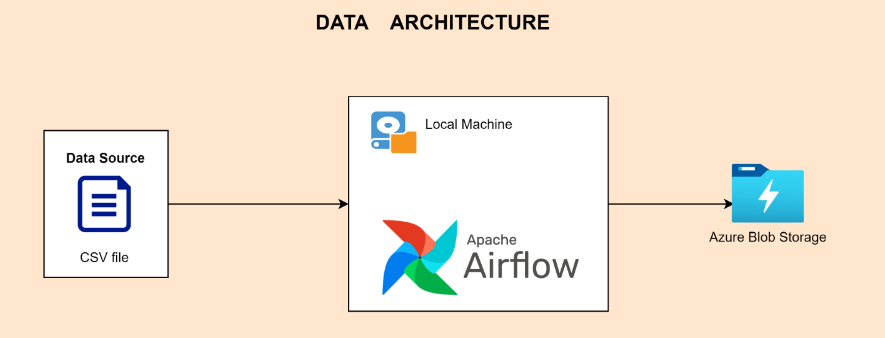
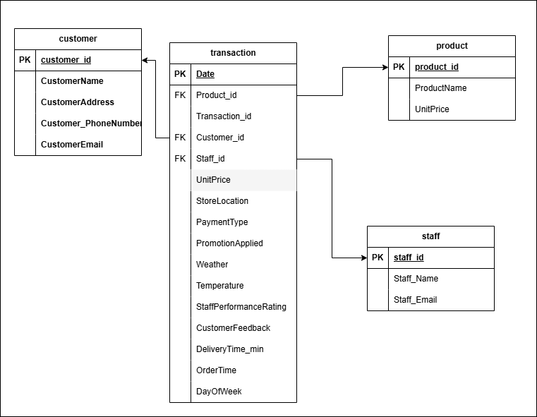

## Project Title: Sales Data Pipeline Optimization for Zipco Foods
### Project Overview
Business Problem: Zipco Foods generates large volumes of daily sales data stored across multiple CSV files without a centralized data storage solution. This fragmentation limits real-time access and analysis, impacting decision-making and operational efficiency. The project aims to unify, cleanse, and structure this data to enable efficient data access and analytics.
Objective: Develop a scalable ETL pipeline that consolidates sales and inventory data, supports real-time insights, and ensures data accuracy, integrity, and accessibility.

### Solution Approach
- Data Ingestion: Automate data collection from multiple CSV sources, standardize formats, and load them into a unified storage system.
- Data Transformation: Data Modeling to remove redundacy and easy retrieval of insights, Data Cleaning, and format the raw data for consistency, adding calculated fields for enriched analytics.

- Data Storage: Store the processed data in a relational database or data warehouse for efficient querying, analysis, and integration with BI tools.
- Data Accessibility: Design API endpoints and dashboards for real-time access to sales and inventory insights.
### Technical Implementation
**Tools & Technologies**:
- Ingestion: Apache Airflow for scheduling and managing ETL jobs
- Transformation: Python for data processing and Pandas for CSV handling
- Storage: Azure Blob Storaeg for centralized data storage
- Analysis & Visualization: Power BI / Tableau for creating sales dashboards
**ETL Pipeline**:
- Step 1: Extract data from CSV files using Python scripts and store raw data in staging tables.
- Step 2: Apply transformations for data cleaning, normalization, and aggregation.
- Step 3: Load transformed data into the primary database, categorized by sales and inventory tables for efficient querying.
### Challenges & Solutions
- Challenge: Managing large data files with inconsistent formatting.
- Solution: Use data validation checks and automated error reporting to ensure data consistency before loading into the database.
### Results & Insights
- Improved data accessibility with real-time dashboards.
- Enhanced decision-making with timely and accurate insights.
- Reduced data processing times by 40% through optimized ETL operations.
### Future Enhancements
Integrate machine learning models for predictive sales insights.

